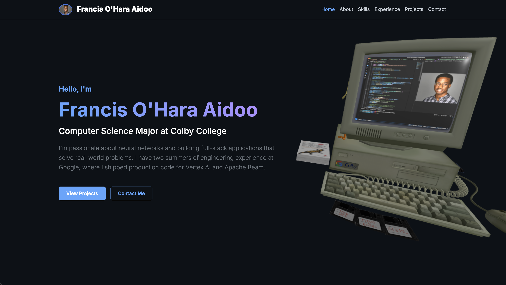

# Francis O'Hara Aidoo - Portfolio Website

[](https://opensource.org/licenses/MIT)
[](https://threejs.org/)
[](https://getbootstrap.com/)

<div align="center">
  
</div>

Welcome to my personal portfolio website! This project showcases my experience, skills, and projects as a Computer Science student and Software Engineer.  
It features a modern, dark-themed design with interactive 3D elements and a focus on visual excellence.

## 🚀 Live Demo
[Check out the live site here](https://francisohara.com/)

## ✨ Features
- **Modern Aesthetics**: GitHub-inspired dark mode styling with glassmorphism effects on the navbar.
- **Interactive 3D Hero**: Integrated **Three.js** scene featuring a rotating 3D model (`retro-computer.glb`) to create a dynamic first impression.
- **Responsive Design**: Built with **Bootstrap 5**, ensuring the site looks great on mobile, tablet, and desktop.
- **Smooth Navigation**: Sticky navbar with scroll-spy and smooth scrolling to sections.
- **Dynamic Content**: Custom-styled skill badges, experience timeline, and project cards with hover effects.


## 🛠️ Tech Stack
- **Core**: HTML5, CSS3, JavaScript (ES6+)
- **3D Graphics**: Three.js (WebGL)
- **Framework**: Bootstrap 5.3
- **Typography**: Inter (Google Fonts)
- **Icons**: Font Awesome 6

## 📁 Project Structure
```text
francisohara.com/
├── assets/
│   ├── css/
│   │   └── style.css           # Custom dark theme & glassmorphism
│   ├── images/
│   │   ├── profile_pic.jpg     # Profile image
│   │   ├── site-preview.png    # Live Preview Placeholder
│   │   └── Favicon-Retro-Computer.png # Site favicon
│   ├── models/
│   │   └── retro-computer.glb  # 3D Hero Model
│   └── js/
│       ├── main.js             # UI logic & Scroll-spy
│       └── three-scene.js      # Three.js scene & model loader
├── data/
│   ├── RESUME.md
│   └── LINKEDIN.md
├── index.html                  # Main application entry
├── LICENSE                     # MIT License
└── README.md
```

## 💻 Local Development

1. **Clone the repository**:
   ```bash
   git clone https://github.com/francis-ohara/francisohara.com.git
   cd francisohara.com
   ```

2. **Run a local server**:
   Since this project uses ES6 modules (for Three.js), you need a local server.

   *Using Python:*
   ```bash
   python3 -m http.server
   ```

   *Using Node.js (http-server):*
   ```bash
   npx http-server
   ```

3. **Open in Browser**:
   Visit `http://localhost:8000` (or the port specified in your terminal).

## 📩 Contact
- **LinkedIn**: [linkedin.com/in/francis-ohara](https://linkedin.com/in/francis-ohara)
- **Email**: [franciskohara@gmail.com](mailto:franciskohara@gmail.com)
- **GitHub**: [@francis-ohara](https://github.com/francis-ohara)
